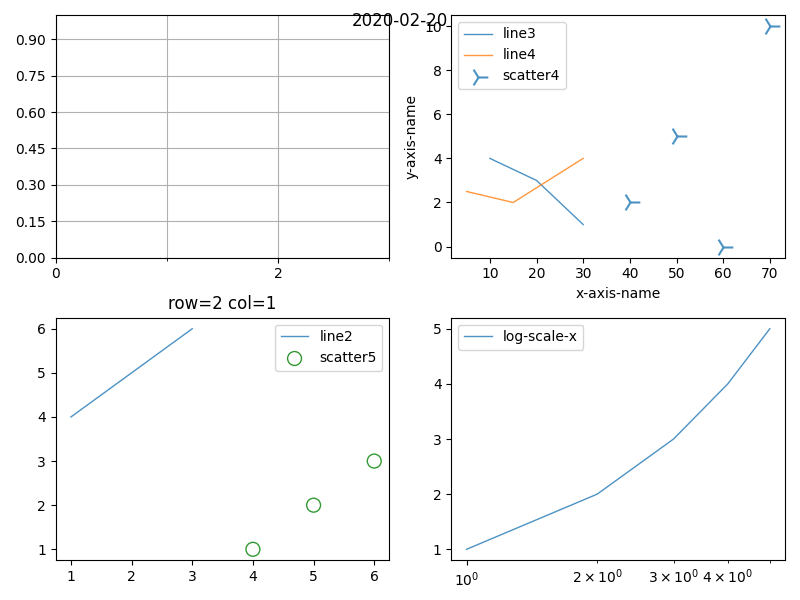
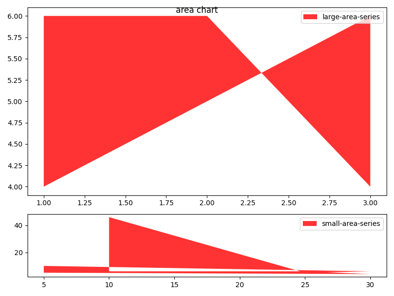
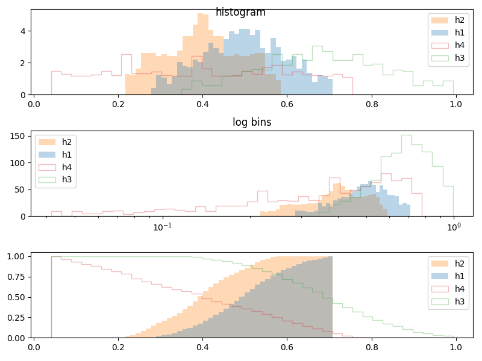

# Vitro

*vitro* is a c++ binding to matplotlib.






The differences from matplotlib-cpp are:
- stateless API
- datetime type in x-axis
- (TODO) more backends in the future

The current implementation is ugly but supports `line(x,y)`, `scatter(x,y)`, `area(x,y1,y2)`.

## Example
```
BAZEL_CXXOPTS=-I/usr/include/python3.8:-I/usr/lib/python3.8/site-packages/numpy/core/include
(open BUILD file and change -lpython3.8 to your version)
bazel build example
./bazel-bin/example
(plot{1,2,3}.png)
```

## Usage
```cpp
void plot() {
  Figure fig(2, 2);
  fig.title = "2020-02-02";

  auto& ax1 = fig.axes(2, 1);
  ax1.line("line2", {1, 2, 3}, {4, 5, 6});
  ax1.scatter("scatter5", {4, 5, 6}, {1, 2, 3});
  ax1.title = "row=2 col=1";

  auto& ax2 = fig.axes(1, 2);
  ax2.line("line3", {10, 20, 30}, {4, 3, 1});
  ax2.scatter("scatter4", {40, 50, 60, 70}, {2, 5, 0, 10});
  ax2.xlabel = "x-axis-name";
  ax2.ylabel = "y-axis-name";

  Matplot matplot(fig);
  matplot.save("plot2.png");
}
```

### Customize

```
auto ax1 = ..
{
  auto& scatter = ax1.scatter("scatter5", {4, 5, 6}, {1, 2, 3});
  scatter.marker_size = 100;
  scatter.color = "green";
  scatter.marker_face_color = "none";
}
```
