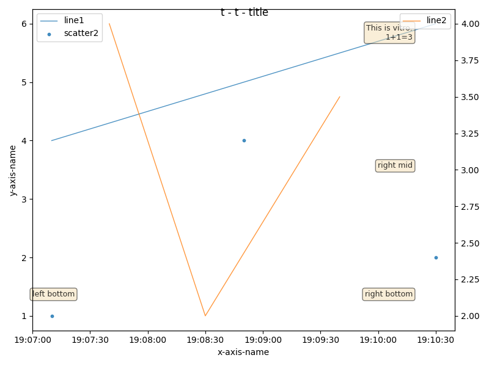

# Vitro

*vitro* is a c++ binding to matplotlib.




The differences from matplotlib-cpp are:
- stateless API
- datetime type in x-axis
- (TODO) more backends in the future

The current implementation is ugly but supports `line(x,y)`, `scatter(x,y)`, `area(x,y1,y2)`.

## Example
```
bazel build example
./bazel-bin/example
(plot1.png)
(plot2.png)
```

## Usage
```cpp
void plot1() {
  Figure fig{};
  fig.title = "t - t - title";

  auto& ax = fig.axes(1, 1);
  ax.line("line1", {1, 2, 3}, {4, 5, 6});
  ax.scatter("scatter2", {4, 5, 6}, {1, 2, 3});
  ax.xlabel = "x-axis-name";
  ax.ylabel = "y-axis-name";

  Matplot matplot(fig);
  matplot.save("plot1.png");
}

void plot2() {
  Figure fig(2, 2);
  fig.title = "2020-02-02";

  auto& ax1 = fig.axes(2, 1);
  ax1.line("line2", {1, 2, 3}, {4, 5, 6});
  ax1.scatter("scatter5", {4, 5, 6}, {1, 2, 3});
  ax1.title = "row=2 col=1";

  auto& ax2 = fig.axes(1, 2);
  ax2.line("line3", {10, 20, 30}, {4, 3, 1});
  ax2.scatter("scatter4", {40, 50, 60, 70}, {2, 5, 0, 10});
  ax2.xlabel = "x-axis-name";
  ax2.ylabel = "y-axis-name";

  Matplot matplot(fig);
  matplot.save("plot2.png");
}
```
